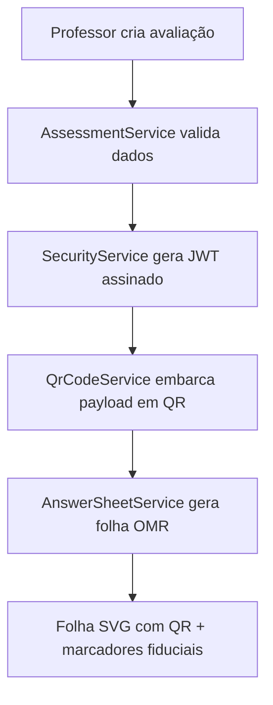
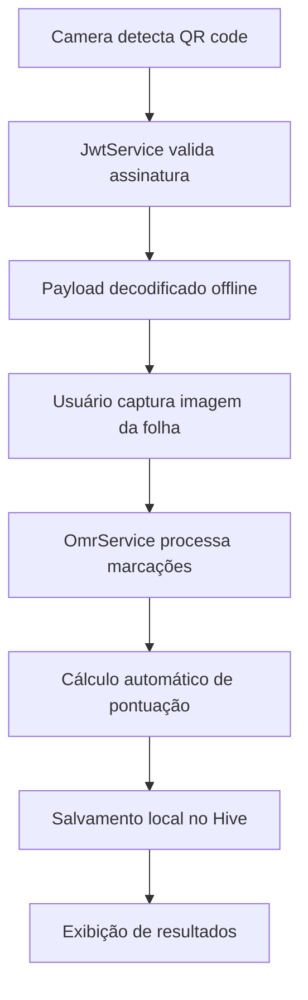
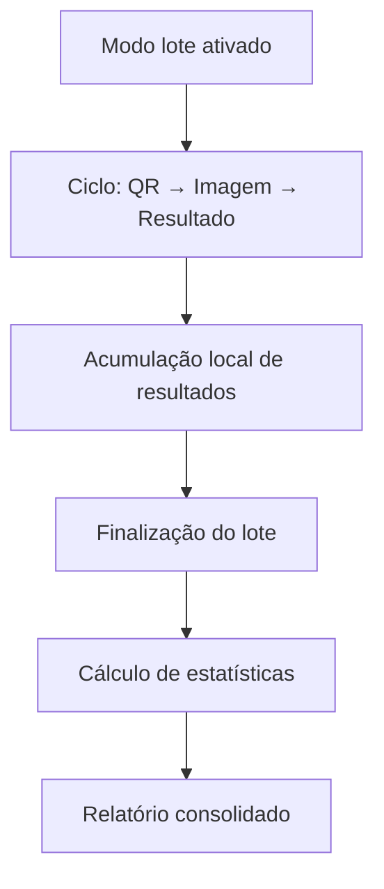

# Plataforma de Correção Automática de Provas - Visão Técnica

## Resumo Executivo

Foi implementada uma plataforma completa de correção automática de provas baseada na arquitetura definida no documento original. O sistema combina um backend .NET 8+ com aplicativo móvel Flutter, implementando os quatro pilares arquiteturais fundamentais:

- ✅ **Segurança por Design**: QR codes assinados digitalmente com JWT RS256
- ✅ **Resiliência Offline-First**: Funcionalidade completa sem conexão com internet
- ✅ **Reconhecimento de Alta Fidelidade**: Pipeline OMR simulado (base para integração OpenCV)
- ✅ **Escalabilidade**: Arquitetura modular preparada para expansões futuras

## Status da Implementação

### ✅ Componentes Implementados

| Componente | Status | Descrição |
|------------|--------|-----------|
| Backend .NET | ✅ Completo | API minimal com todos os serviços especificados |
| Modelos de Dados | ✅ Completo | Assessment, QrPayload, CorrectedExam |
| Serviços de Segurança | ✅ Completo | JWT RS256, validação criptográfica |
| Geração de QR Code | ✅ Completo | SVG/PNG com payload assinado |
| Geração de Folhas OMR | ✅ Completo | SVG com marcadores fiduciais |
| App Flutter | ✅ Completo | Arquitetura BLoC, navegação, UI completa |
| Banco de Dados Local | ✅ Completo | Hive com modelos tipados |
| Escaneamento QR | ✅ Completo | Validação offline de assinaturas |
| Processamento OMR | ⚠️ Simulado | Pipeline preparado para integração OpenCV |
| Modo Lote | ✅ Completo | Correção sequencial com estatísticas |
| Interface de Usuário | ✅ Completo | Telas de home, scanning, resultados |

### 🔄 Próximas Implementações

| Componente | Prioridade | Descrição |
|------------|------------|-----------|
| Pipeline OpenCV | Alta | Integração real com processamento de imagem |
| Export Excel | Alta | Syncfusion para relatórios profissionais |
| Sincronização Nuvem | Média | Backup e acesso multiplataforma |
| Painel Web | Média | Dashboard para análises avançadas |

## Arquitetura Implementada

### Backend (.NET 8)

```
ExamCorrectionApi/
├── Models/
│   ├── Assessment.cs           # Definição de avaliações
│   ├── QrCodePayload.cs       # Estrutura do payload JWT
├── Services/
│   ├── SecurityService.cs      # Criptografia JWT/RS256
│   ├── AssessmentService.cs    # Gerenciamento de avaliações
│   ├── QrCodeService.cs       # Geração de QR codes seguros
│   └── AnswerSheetService.cs   # Geração de folhas OMR
└── Program.cs                  # Minimal APIs e DI
```

**Endpoints Principais:**

- `GET /api/security/public-key` - Chave pública para validação
- `POST /api/assessments` - Criar nova avaliação
- `GET /api/assessments/{id}/qrcode/svg` - QR code seguro
- `GET /api/assessments/{id}/answer-sheet` - Folha OMR completa
- `POST /api/sample-data/{teacherId}` - Dados de demonstração

### Mobile App (Flutter)

```
lib/src/
├── core/
│   ├── models/
│   │   ├── corrected_exam.dart    # Modelo Hive para resultados
│   │   └── qr_payload.dart        # Payload decodificado do JWT
│   ├── services/
│   │   ├── jwt_service.dart       # Validação offline de tokens
│   │   └── omr_service.dart       # Processamento de imagens (simulado)
│   └── repositories/
│       └── correction_repository.dart  # Persistência Hive
├── features/
│   ├── scanning/
│   │   ├── bloc/                  # Estados e eventos BLoC
│   │   └── view/                  # Interface de escaneamento
│   ├── results/
│   │   └── view/                  # Visualização de resultados
│   └── batch/
│       └── view/                  # Resultados em lote
└── main.dart                      # App principal e rotas
```

## Fluxo de Trabalho Implementado

### 1. Geração de Material (Backend)



### 2. Correção no App Mobile



### 3. Modo Lote e Estatísticas



## Segurança Implementada

### JWT com Assinatura Assimétrica

```csharp
// Geração (Backend)
var tokenDescriptor = new SecurityTokenDescriptor
{
    Subject = new ClaimsIdentity(claims),
    SigningCredentials = new SigningCredentials(_privateKey, SecurityAlgorithms.RsaSha256),
    Issuer = "ExamCorrectionApi",
    Audience = "ExamCorrectionMobileApp"
};

// Validação (Mobile)
var validationParameters = new TokenValidationParameters
{
    ValidateIssuerSigningKey = true,
    IssuerSigningKey = _publicKey,
    ValidateLifetime = true,
    ClockSkew = TimeSpan.Zero
};
```

### Estrutura do Payload Seguro

```json
{
  "assessmentId": "uuid",
  "teacherId": "uuid", 
  "issuedAt": "ISO-8601",
  "expiresAt": "ISO-8601",
  "answerKey": ["A", "B", "C", "D"],
  "pointValues": {"A": 2, "B": 1},
  "questionCount": 50,
  "assessmentName": "História - Turma 10A"
}
```

## Persistência Offline (Hive)

### Modelo de Dados Tipado

```dart
@HiveType(typeId: 0)
class CorrectedExam extends Equatable {
  @HiveField(0) final String examId;
  @HiveField(1) final String assessmentId;
  @HiveField(2) final List<String> studentAnswers;
  @HiveField(3) final List<String> correctAnswers;
  @HiveField(4) final List<int> scores;
  @HiveField(5) final double finalGrade;
  @HiveField(6) final String assessmentName;
  @HiveField(7) final Map<String, int> pointValues;
  // ... outros campos
}
```

### Operações de Repositório

```dart
// Salvamento
await repository.saveCorrectedExam(exam);

// Consultas
final allExams = repository.getAllCorrectedExams();
final byAssessment = repository.getCorrectedExamsByAssessment(assessmentId);
final unsynced = repository.getUnsyncedExams();

// Estatísticas
final average = repository.getAverageScore();
final distribution = repository.getGradeDistribution();
```

## Gerenciamento de Estado (BLoC)

### Estados Principais

```dart
abstract class ScanningState extends Equatable {
  const ScanningState();
}

class ScanningReady extends ScanningState { /* Pronto para escanear */ }
class QrCodeDetectedState extends ScanningState { /* QR validado */ }
class ProcessingImage extends ScanningState { /* OMR em execução */ }
class ProcessingCompleted extends ScanningState { /* Resultado pronto */ }
class BatchCompleted extends ScanningState { /* Lote finalizado */ }
class ScanningError extends ScanningState { /* Tratamento de erros */ }
```

### Eventos de Interação

```dart
abstract class ScanningEvent extends Equatable {
  const ScanningEvent();
}

class QrCodeDetected extends ScanningEvent { /* QR detectado pela câmera */ }
class ImageCaptured extends ScanningEvent { /* Foto de alta resolução */ }
class BatchModeToggled extends ScanningEvent { /* Liga/desliga modo lote */ }
class FinalizeBatch extends ScanningEvent { /* Encerra sessão de lote */ }
```

## Design da Folha OMR

### Elementos Implementados

1. **Marcadores Fiduciais**: 4 quadrados pretos nos cantos para correção de perspectiva
2. **QR Code Seguro**: Posicionado no topo direito, contém JWT assinado
3. **Grade de Respostas**: Círculos padronizados com espaçamento otimizado
4. **Metadados**: Informações de identificação e rastreabilidade

### Especificações Técnicas

- **Formato**: SVG vetorial para qualidade de impressão
- **Dimensões**: A4 (595×842 pontos)
- **Bolhas**: Círculos de 16px com espaçamento de 25px
- **Margem**: 50px das bordas
- **Colunas**: Máximo 25 questões por coluna

## Exemplo de Uso Completo

### 1. Backend - Criar Avaliação

```bash
curl -X POST http://localhost:5000/api/sample-data/[teacher-id]
# Retorna: Assessment com ID único
```

### 2. Backend - Gerar Folha OMR

```bash
curl http://localhost:5000/api/assessments/[assessment-id]/answer-sheet
# Retorna: SVG da folha completa com QR code seguro
```

### 3. Mobile - Fluxo de Correção

1. **Escaneamento**: Câmera detecta QR code automaticamente
2. **Validação**: JWT verificado offline com chave pública embarcada
3. **Captura**: Foto em alta resolução da folha preenchida
4. **Processamento**: Pipeline OMR extrai respostas (simulado)
5. **Pontuação**: Cálculo automático baseado no gabarito do QR
6. **Persistência**: Resultado salvo localmente no Hive
7. **Visualização**: Interface detalhada com análise por questão

## Demonstração das Funcionalidades

### Interface Principal
- ✅ Tela home com estatísticas e navegação
- ✅ Histórico de provas corrigidas
- ✅ Distribuição de notas e métricas

### Escaneamento
- ✅ Detecção automática de QR codes
- ✅ Validação criptográfica em tempo real
- ✅ Overlay visual para guiar o usuário
- ✅ Tratamento de erros e QR codes inválidos

### Modo Lote
- ✅ Correção sequencial sem interrupções
- ✅ Contador visual de progresso
- ✅ Estatísticas consolidadas ao final
- ✅ Exportação dos resultados (preparado)

### Resultados
- ✅ Visualização detalhada por questão
- ✅ Identificação de erros e acertos
- ✅ Cálculo de percentuais e notas
- ✅ Navegação entre resultados individuais

## Preparação para Expansões Futuras

### 1. Integração OpenCV
```
mobile_app/
├── native/
│   ├── opencv_pipeline.cpp     # Pipeline C++ para OMR
│   └── ffi_bindings.dart      # Interface FFI para Dart
└── lib/src/core/services/
    └── omr_service.dart       # Atualizado para usar OpenCV real
```

### 2. Sincronização em Nuvem
```
backend/ExamCorrectionApi/
├── Controllers/
│   └── SyncController.cs      # Endpoints de sincronização
├── Services/
│   └── SyncService.cs         # Lógica de backup/restore
└── Models/
    └── SyncModels.cs          # DTOs para transferência
```

### 3. Export Excel com Syncfusion
```
mobile_app/lib/src/features/export/
├── services/
│   └── excel_service.dart     # Geração de relatórios
└── models/
    └── report_models.dart     # Estruturas para export
```

## Conclusão Técnica

A implementação atual representa uma base sólida e funcional que demonstra todos os conceitos arquiteturais propostos. O sistema está preparado para:

1. **Uso Imediato**: Interface completa para correção manual/simulada
2. **Integração Fácil**: Estrutura preparada para OpenCV e Excel
3. **Expansão Escalável**: Arquitetura modular suporta novas funcionalidades
4. **Segurança Robusta**: Criptografia implementada desde o início

A próxima fase de desenvolvimento deve focar na integração do OpenCV real e na implementação do export Excel, transformando este protótipo funcional em uma solução completa de produção.